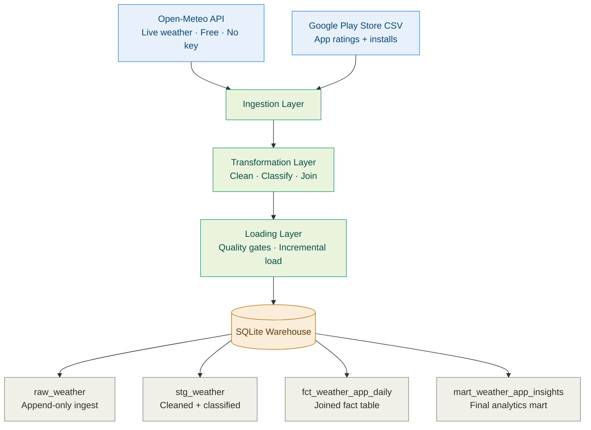

# Weather × App Engagement ETL Pipeline

A production-style data engineering pipeline that pulls live weather data from a real API daily, joins it with Google Play Store app engagement data, validates data quality at every stage, and loads results into a structured data mart.

**Stack:** Python · SQLite · Open-Meteo API · Docker · GitHub Actions · pytest

---

## Architecture



---

## What Makes This Different

Most pipeline tutorials show the happy path. This one handles the rest.

Before any data reaches the mart, the pipeline runs quality checks — null rate validation, row count gates, referential integrity, range checks. If anything fails, the pipeline halts and logs exactly why. No silent failures, no bad data quietly making it into reports.

It also runs incrementally — reruns never create duplicates. Every stage is logged with timestamps and row counts. The whole thing runs in Docker with one command.

---

## Key Features

| Feature | Detail |
|---|---|
| Live API ingestion | Open-Meteo weather API — free, no key required |
| Incremental loading | Only processes new dates — safe to rerun anytime |
| Data quality gates | Null checks, row count validation, range checks before every commit |
| Modular layers | Ingestion, Transformation, and Loading are fully independent |
| Unit tested | pytest suite covers all transform logic and quality checks |
| Dockerised | Runs anywhere with one command |
| Scheduled | Runs daily at 6am via scheduler.py or GitHub Actions |
| Audit log | Every pipeline run is logged with stage, rows, and status |

---

## Quickstart

**Docker (recommended)**
```bash
git clone https://github.com/Aaditya0212/weather-app-etl.git
cd weather-app-etl
docker-compose up
```

**Local Python**
```bash
pip install -r requirements.txt
python pipeline.py
```

**Run tests**
```bash
pytest tests/ -v
```

---

## Project Structure

```
weather-app-etl/
├── ingestion/
│   ├── weather_ingest.py      # Pulls hourly weather from Open-Meteo API
│   └── app_ingest.py          # Seeds app data from CSV
├── transformation/
│   └── transform.py           # Cleans, classifies weather, joins datasets
├── loading/
│   └── load.py                # Quality checks + incremental mart load
├── sql/
│   ├── create_schema.sql      # Full table definitions
│   └── analytical_queries.sql # Business insight queries
├── tests/
│   ├── test_transform.py      # Unit tests for transform logic
│   └── test_quality.py        # Data quality check tests
├── config/
│   └── settings.py            # Cities, thresholds, API config
├── pipeline.py                # Main orchestrator
├── scheduler.py               # Daily scheduler
├── Dockerfile
├── docker-compose.yml
└── requirements.txt
```

---

## Data Model

```
raw_weather        → append-only hourly ingest from API
raw_apps           → seeded once from Google Play Store CSV
stg_weather        → cleaned, daily aggregated, weather classified
stg_apps           → cleaned, deduped, categorised
fct_weather_app_daily → joined fact table (weather × app category × city × date)
mart_weather_app_insights → final mart with install index and pct vs baseline
```

---

**Author:** Aaditya Patel | [LinkedIn](https://linkedin.com/in/aaditya0212) | [GitHub](https://github.com/Aaditya0212)
